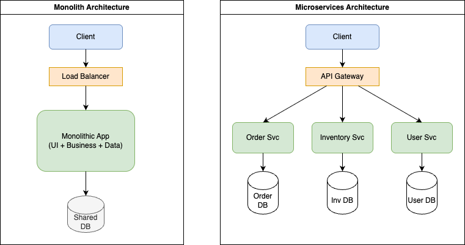
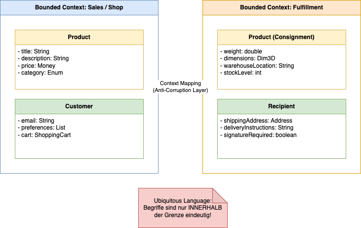
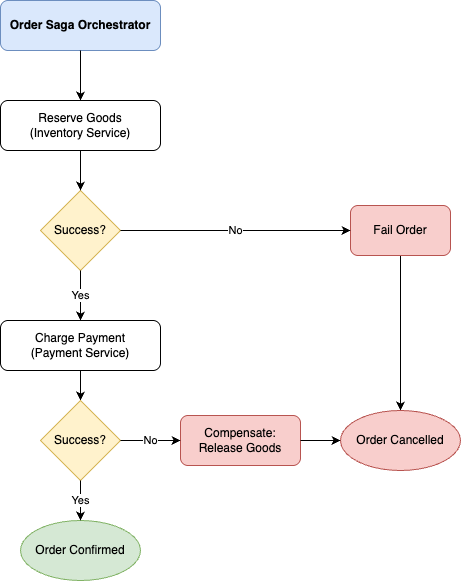
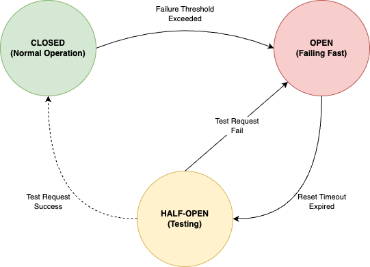
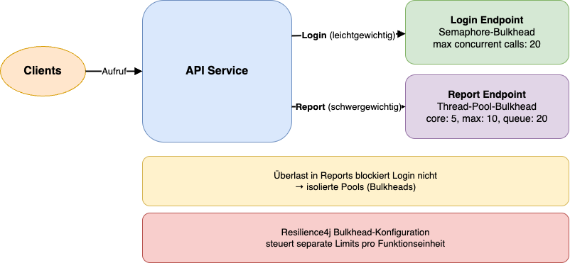
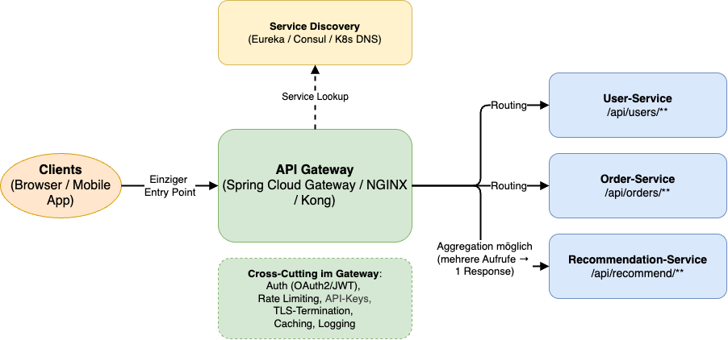

<style>
img[alt~="center"] {
  display: block;
  margin: 0 auto;
}
</style>

# Microservice-Architektur & Distributed Patterns

---

## In diesem Modul

* Monolith vs. Microservices & DDD-Grundlagen
* Datenhaltung in Microservices
* Resilience Patterns: Circuit Breaker, Bulkhead
* Infrastruktur: API Gateway, Service Discovery, Externalized Configuration

---

## Wiederholung: Monolith vs. Microservices

Es geht nicht nur um die Größe der Services (_Micro_), sondern um **Unabhängigkeit**.

* **Monolith:** Eine Deployment-Unit, geteilter State, interne Methodenaufrufe.
    * **Pro:** Einfaches Refactoring, ACID-Transaktionen, zu Beginn einfaches Deployment.
    * **Con:** Scaling nur als Ganzes, Technologie-Lock-in, "Big Ball of Mud".
* **Microservices:** Unabhängig deploybare Services, Kommunikation über Netzwerk.
    * **Pro:** Unabhängiges Scaling, Tech-Stack Freiheit, Isolation von Fehlern.
    * **Con:** Verteilte Komplexität, Netzwerk-Latenz, Eventual Consistency

---



---

## Domain Driven Design (DDD)

* Ohne sauberen Schnitt der Fachlichkeit enden Microservices im Chaos ("Distributed Monolith"). DDD ist das Werkzeug für diesen Schnitt.
* Die wichtigste Erkenntnis in DDD: **Es gibt kein einheitliches Datenmodell für das gesamte Unternehmen.**
* **Bounded Context:**
Eine explizite Grenze, innerhalb derer ein bestimmtes Modell gültig ist.
* **Ubiquitous Language:**
Eine gemeinsame, unmissverständliche Sprache zwischen Entwicklern und Fachexperten *innerhalb* dieses Kontexts.

---

## Beispiel: Polysemie (Mehrdeutigkeit)

<style scoped>
section {
    font-size: 30px;
}
</style>
Der Begriff **"Produkt"** bedeutet je nach Abteilung etwas völlig anderes:



---

## Beispiel: Polysemie (Mehrdeutigkeit)

* **Sales:** Braucht Preis, Bilder, SEO-Texte.
* **Fulfillment:** Braucht Gewicht, Lagerplatz, Gefahrgutklasse. Preis ist hier egal.
* *Fazit:* Wir bauen keine riesige `Product`-Klasse mit 200 Feldern, sondern zwei getrennte Services (`SalesService`, `ShippingService`) mit eigenen Modellen.

---

## Context Mapping: Wie kommunizieren die Grenzen?

Wenn Service A mit Service B redet, müssen wir die Beziehung definieren.

* **Shared Kernel:** Beide teilen sich eine Library. Vorsicht: hohe Kopplung.
* **Customer / Supplier:** Ein Team (Supplier) liefert, was das andere (Customer) braucht.
* **Anti-Corruption Layer (ACL):**
    * Service B will sein sauberes Modell nicht durch das "schmutzige" oder fremde Modell von A verunreinigen.
    * Er baut eine Adapter-Schicht, die Anfragen von A übersetzt.
    * *Essentiell bei Integration von Legacy-Systemen!*
* **Open Host Service:** Ein Service bietet eine öffentliche, standardisierte API (z.B. REST/Swagger) für alle an.

---

# Datenverwaltung in Microservice-Architekturen

---

## Database per Service

Eine der wichtigsten Regel in Microservice-Architekturen: Ein Service darf **niemals** direkt auf die Datenbank eines anderen Services zugreifen.

* **Warum?**
Entkopplung. Wenn Service A das Schema ändert, darf Service B nicht brechen.
* **Herausforderung:** Wie joine ich Daten?
    * *Lösung 1:* API Composition (Gateway/Aggregator ruft beide auf).
    * *Lösung 2:* Data Replication / Caching (Service B speichert eine Kopie der notwendigen Daten von A via Events).

---

## CAP Theorem & Eventual Consistency

In verteilten Systemen müssen wir uns entscheiden (Pick two):

1. **C**onsistency (Alle sehen die gleichen Daten zur gleichen Zeit).
2. **A**vailability (Das System antwortet immer).
3. **P**artition Tolerance (Das System läuft weiter, auch wenn das Netzwerk bricht).

Da Netzwerke brechen *werden* (P), müssen wir zwischen C und A wählen.
Microservices wählen meist **AP** (Availability) und akzeptieren **Eventual Consistency** (Daten sind "irgendwann" konsistent).

---

## Verteilte Transaktionen in Spring Boot

* Spring Boot unterstützt **JTA (Java Transaction API)** und damit **XA-Transaktionen** (z.B. mit `spring-boot-starter-jta-atomikos`).
* Dies ermöglicht die Koordination von Transaktionen über mehrere **XA-kompatible Ressourcen** (z.B. zwei Datenbanken, oder eine Datenbank und einen JMS-Broker) hinweg.
* In Microservice-Architekturen ist dies aber nicht von Vorteil.

---

## JTA/XA ist nicht gut für Microservices geeignet

1. **REST ist zustandslos:** Der Transaktionskontext müsste in Requests mit Headern propagiert werden. Dies widerspricht aber der Zustandslosigkeit von REST. Jeder Service agiert mit seinen eigenen Ressourcen in lokalen Transaktionen.
2. **Blocking & Availability:** XA erfordert, dass alle beteiligten Ressourcen bis zum Commit oder Rollback gesperrt bleiben. In einem System mit vielen, über HTTP gekoppelten Services würde dies zu massiven Performance- und Verfügbarkeitsproblemen führen (Verstoß gegen das CAP-Theorem zugunsten von strikter Konsistenz).
3. **Fehlende Protokoll-Unterstützung:** Es gibt kein standardisiertes, weit verbreitetes Protokoll, um XA-Transaktionen über HTTP/REST-Servicegrenzen hinweg zu propagieren.

---

## Fazit: Saga statt XA

* JTA/XA ist eine Lösung für verteilte Transaktionen **innerhalb einer JVM oder eines eng gekoppelten Systems**.
* Für eine lose gekoppelte, über HTTP kommunizierende Microservice-Architektur ist es jedoch die falsche Wahl.
* Hier kommen sogenannte **Sagas** zum Einsatz.

> _Saga ist tatsächlich kein Akronym. Es steht einfach nur für eine lange Geschichte._

---

## Saga-Ansatz 1: Choreography (Event-Driven)

Jeder Service entscheidet selbst, was zu tun ist. Es gibt keinen zentralen Koordinator.

* **Ablauf:** `OrderService` -> `Event: OrderCreated` -> `InventoryService` -> `Event: GoodsReserved` -> `PaymentService`.
* *Pro:* Lose Kopplung, keine zentrale Logik.
* *Con:* Unübersichtlich ("Wer hört auf wen?"). Zyklische Abhängigkeiten schwer zu erkennen.

---

## Saga-Ansatz 2: Orchestration (Command-Driven)

Ein zentraler "Conductor" (Klasse oder Service) kennt den gesamten Ablauf und sagt den Teilnehmern, was sie tun sollen.



* **Ablauf:** Orchestrator ruft `Inventory.reserve()` auf. Bei Erfolg ruft er `Payment.charge()` auf.
* *Pro:* Klarer Ablauf, einfache Fehlerbehandlung, zentraler Zustand.
* *Con:* Orchestrator kann zum "Gott-Service" werden (zuviel Logik).

---

## Saga Orchestration (Naive Implementierung)

* Ein einfacher Orchestrator nutzt oft `try-catch` (siehe folgende Seite).
* **Achtung:** Das ist fragil! Wenn der Server im `catch`-Block in einen Fehler läuft, haben wir einen inkonsistenten Zustand.

 > In Produktion kann man **State Machines** einsetzen, die den Status in DB persistieren. Es gibt auch spezialisierte Frameworks wie Camunda.

---

```java
@Service
public class OrderSagaOrchestrator {
    @Autowired private OrderRepository orderRepo;
    @Autowired private RestClient inventoryClient;
    @Autowired private RestClient paymentClient;

    public void placeOrder(Order order) {
        orderRepo.save(order); // 1. Local TX

        try {
            // 2. Remote Steps (Commands)
            inventoryClient.post().uri("/reserve").body(order).retrieve();
            paymentClient.post().uri("/charge").body(order).retrieve();
            
            order.setStatus(OrderStatus.CONFIRMED); // Success
            orderRepo.save(order);

        } catch (Exception e) {
            // --- KOMPENSATION (Rollback) ---
            // Da Payment fehlschlug, müssen wir Inventory stornieren!
            // Problem: Was wenn dieser Call fehlschlägt? -> Retry / Dead Letter Queue
            inventoryClient.post().uri("/release").body(order).retrieve();
            
            order.setStatus(OrderStatus.FAILED);
            orderRepo.save(order);
        }
    }
}
```

---

# Resilience & Stability Patterns

---

## Circuit Breaker

* Der Circuit Breaker schützt das Gesamtsystem vor kaskadierenden Fehlern.  
* Wenn ein Zielservice nicht erreichbar ist oder zu viele Fehler produziert, werden Aufrufe nicht mehr ausgeführt, sondern *sofort* abgewiesen (Fail Fast).
* Das verhindert Timeout-Kaskaden und bewahrt freie Ressourcen.

---

## Zustände

* **Closed:** Normalbetrieb, Fehler werden beobachtet.  
* **Open:** Fehlerschwelle überschritten → neue Requests sofort ablehnen.  
* **Half-Open:** Testphase: Einige Requests werden durchgelassen, um zu prüfen, ob der Service wieder gesund ist.



---

## Circuit Breaker mit Spring: Annotationsbasiert

```java
@Service
public class RecommendationClient {

    private final WebClient client = WebClient.create("http://recommendation-service");

    @CircuitBreaker(name = "recommendations", fallbackMethod = "fallback")
    public List<String> getRecommendations(String productId) {
        return client.get()
            .uri("/recommend/{id}", productId)
            .retrieve()
            .bodyToMono(new ParameterizedTypeReference<List<String>>() {})
            .block();
    }

    private List<String> fallback(String productId, Throwable t) {
        return List.of("bestseller-1", "bestseller-2");
    }
}
```

---

## Circuit Breaker: Programmatisch

```java
CircuitBreaker breaker = circuitBreakerRegistry.circuitBreaker("recommendations");

Supplier<List<String>> call = () -> client.get()
    .uri("/recommend/{id}", productId)
    .retrieve()
    .bodyToMono(new ParameterizedTypeReference<List<String>>() {})
    .block();

Supplier<List<String>> protectedCall =
    CircuitBreaker.decorateSupplier(breaker, call);

try {
    return protectedCall.get();
} catch (Exception e) {
    return List.of("bestseller-1", "bestseller-2");
}
```

---

## Bulkhead Pattern

* Das Bulkhead-Pattern sorgt dafür, dass Fehler oder Überlast *lokal* bleiben.  
* Statt alle Anfragen über einen gemeinsamen Thread-Pool laufen zu lassen, isolieren wir kritische Pfade in eigene Ressourcenpools.  
* So verhindert man, dass etwa ein überlasteter Report-Service das gesamte System blockiert.



---

## Beispiel: ReportService

1. `ReportService` erzeugt viele rechenintensive Reports  
2. Der globale Thread-Pool ist komplett belegt  
3. Der Login hängt, obwohl er eigentlich sehr schnell wäre  
4. Das gesamte System wirkt "kaputt" – obwohl nur ein Teilbereich überlastet ist  

---

## Lösung: Dedizierte Thread-Pools oder Semaphoren

Mit Bulkheads definieren wir pro Funktionseinheit eigene Limits:

* z.B. **10 Threads für Reports**
* z.B. **20 gleichzeitige Aufrufe für Login**
* Fehlschläge bleiben isoliert → der Rest bleibt stabil

---

### Thread-Bulkheads

<style scoped>
section {
    font-size: 25px;
}
</style>

```yaml
resilience4j:
  thread-pool-bulkhead:
    reportService:
      core-thread-pool-size: 5
      max-thread-pool-size: 10
      queue-capacity: 20
```

```java
@Service
public class ReportClient {

    @Bulkhead(name = "reportService", type = Bulkhead.Type.THREADPOOL)
    @CircuitBreaker(name = "reportService")
    public CompletableFuture<String> generateReport() {
        return CompletableFuture.supplyAsync(() -> {
            heavyComputation(); return "OK";
        });
    }
}
```

---

### Semaphore-Bulkhead

```yaml
resilience4j:
  bulkhead:
    loginService:
      max-concurrent-calls: 20
```

```java
@Service
public class LoginClient {

    @Bulkhead(name = "loginService", type = Bulkhead.Type.SEMAPHORE)
    public UserInfo login(String user, String password) {
        return authApi.login(user, password);
    }
}
```

---

# Infrastructure Patterns

---

## API Gateway

* Ein API Gateway bündelt Zugriffe auf viele Microservices und stellt für Clients eine einheitliche, stabile Schnittstelle bereit.  
* Statt 20–50 Services einzeln anzusprechen, kommunizieren Browser oder Mobile Apps nur noch mit *einem* Entry Point.

---
<style scoped>
section {
    font-size: 25px;
}
</style>

## Aufgaben eines Gateways

* **Routing**: Requests werden an interne Services weitergeleitet:  
`/api/users` → `user-service:8080`
* **Aggregation**: Mehrere Serviceantworten können in einem einzigen Response kombiniert werden.  
→ Reduziert Netzwerkroundtrips für Clients.
* **Offloading**: Zentrale Cross-Cutting-Aufgaben:  
    * Authentifizierung & Autorisierung (OAuth2, JWT)  
    * Rate Limiting & API-Keys  
    * SSL/TLS Termination  
    * Caching  
* **Tools:** Spring Cloud Gateway, NGINX, Kong, Ambassador, Istio (Ingress Gateway)

---



---

## Beispiel: Routing in Spring Cloud Gateway

`application.yaml`

```yaml
spring:
  cloud:
    gateway:
      routes:
        - id: user-service
          uri: http://user-service
          predicates:
            - Path=/api/users/**
          filters:
            - StripPrefix=1
```

---

`GatewayConfig.java`

```java
@Configuration
public class GatewayConfig {

    @Bean
    public RouteLocator routes(RouteLocatorBuilder builder) {
        return builder.routes()
            .route("recommendations", r -> r
                .path("/api/recommend/**")
                .filters(f -> f.stripPrefix(1))
                .uri("http://recommendation-service"))
            .build();
    }
}
```

---

## Service Discovery – Wie Services sich finden

* In einer dynamischen Umgebung wie Kubernetes, Cloud oder VMs ändern sich IP-Adressen und Ports ständig.  
* Service Discovery stellt sicher, dass Services **einander zuverlässig finden**, ohne dass Konfigurationen manuell geändert werden müssen.

---

## Zwei Grundmodelle

* **Client-Side Discovery**: Der Client fragt eine Registry ab (z. B. **Netflix Eureka**) und entscheidet selbst, welchen Service-Node er ansteuert.
    * **Ablauf:**  Client → Registry → (Liste der Instanzen) → direkter Aufruf der Instanz
    * **Frameworks:** Eureka, Consul, Zookeeper

* **Server-Side Discovery**: Der Client ruft einen stabilen Endpoint an (z. B. LoadBalancer, Ingress oder Kubernetes DNS).  
Der LoadBalancer entscheidet, wohin die Anfrage geht.

    * **Ablauf:** Client → LB/Router → Service-Instance
    * **Beispiele:**  Kubernetes Service DNS, AWS ALB, Envoy

---

## Beispiel: Spring Boot mit Eureka (Client-Side)

`application.yml`:

```yaml
eureka:
  client:
    service-url:
      defaultZone: http://eureka:8761/eureka/
spring:
  application:
    name: payment-service
```

---
<style scoped>
section {
    font-size: 20px;
}
</style>
`OrderClient.java`

```java
@Service
public class OrderClient {

    private final RestTemplate rest;

    public OrderClient(RestTemplate rest) {
        this.rest = rest;
    }

    public Order getOrder(String id) {
        return rest.getForObject("http://order-service/orders/" + id, Order.class);
    }
}

@Configuration
class RestTemplateConfig {
    @Bean
    @LoadBalanced
    RestTemplate restTemplate(RestTemplateBuilder builder) {
        return builder.build();
    }
}
```

---

## Externalized Configuration – Konfiguration gehört nicht ins Image

Eine Microservice-Architektur folgt dem Prinzip:  
**Konfiguration wird zur Laufzeit bereitgestellt – nicht in den Build eingebacken.**

Das ermöglicht:

* verschiedene Umgebungen (dev / test / prod) ohne Neu-Build  
* schnelle Konfigurationsänderungen  
* bessere Sicherheit (z. B. Secrets nicht im Git-Repo)

---

## Typische Quellen für externe Config

* **Spring Cloud Config**: Zentraler Config-Server, der Konfiguration aus Git oder Vault ausliefert.

* **Kubernetes Plattform-Mechanismen**
    * _ConfigMaps_ → nicht-sensible Konfiguration  
    * _Secrets_ → sensible Daten (Passwörter, Tokens)  
    * Environment Variables  
    * Volume Mounts

---

## Beispiel: Spring Cloud Config

`bootstrap.yml`:

```yaml
spring:
  application:
    name: product-service
  cloud:
    config:
      uri: http://config-server:8888
```

Der Config-Server unterstützt wiederum verschiedene Backends, beispielsweise git.
Dazu später mehr!
