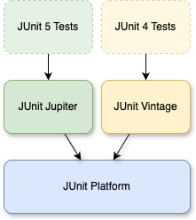

<style>
img[alt~="center"] {
  display: block;
  margin: 0 auto;
}
</style>

# Spring Boot und JUnit 5

---

## In diesem Modul
*   Testpyramide
*   JUnit 5 Basics (Lifecycle, Assertions, Parametrisierung)
*   Dynamische/Nested Tests & Extensions
*   Spring Boot Test-Strategien: `@SpringBootTest` vs. Slices
*   Infrastrukturtests mit Testcontainers
*   Demo und Übungsaufgaben

---

## Testpyramide (Praxisleitplanken)
*   **Unit**: schnell, deterministisch, keine Spring-Kontexte. Ziel: Logik absichern.
*   **Slice**: fokussierte Spring-Teile (`@WebMvcTest`, `@DataJpaTest`, `@JsonTest`, `@RestClientTest`), schneller als Full Context.
*   **Integration**: `@SpringBootTest`, häufig mit Testcontainers für echte Infrastruktur.
*   **E2E**: sparsam, nur kritische Flows.
*   Guideline: Erst Unit/Slice abdecken, dann gezielt wenige Integrations- oder Container-Tests hinzufügen.

---

## JUnit 5-Architektur
Im Gegensatz zu JUnit 4 ist JUnit 5 modular aufgebaut. Es besteht aus drei Hauptkomponenten:



---

## JUnit Platform
*   Das Fundament.
*   Bietet die **Launcher API**, um Tests zu starten (genutzt von IDEs, Build-Tools wie Maven/Gradle).
*   **TestEngine API:** Schnittstelle, damit Dritte eigene Test-Frameworks (z.B. Spock, Cucumber) auf der Plattform laufen lassen können.

---

## JUnit Jupiter
*   Das eigentliche "neue" JUnit.
*   Enthält das neue **Programming Model** (Annotationen, Assertions).
*   Enthält das **Extension Model** (Erweiterungen).

## JUnit Vintage
*   Sorgt für Rückwärtskompatibilität.
*   Eine `TestEngine`, die alte JUnit 3 und 4 Tests auf der JUnit 5 Plattform ausführt.

---

# JUnit 5 Lifecycle und Assertions

---

## Wichtige Annotationen
*   `@Test`: Die Standard-Testmethode (nicht mehr `public` nötig!).
*   `@DisplayName("...")`: Benutzerdefinierter Name für Reports/IDEs.
*   `@BeforeEach` / `@AfterEach`: Setup/Teardown vor/nach **jeder** Methode.
*   `@BeforeAll` / `@AfterAll`: Setup/Teardown einmalig pro Klasse (muss `static` sein, außer bei `@TestInstance(PER_CLASS)`).

---

## Assertions
Klassisch via `org.junit.jupiter.api.Assertions`:

```java
// Grouped Assertions - Alle werden ausgeführt, auch wenn eine fehlschlägt
assertAll("address",
    () -> assertEquals("Berlin", address.getCity()),
    () -> assertEquals("10115", address.getZip())
);

// Exception Testing
assertThrows(IllegalArgumentException.class, () -> {
    service.doSomething(-1);
});
```

---

## Parametrisierte Tests (@ParameterizedTest)

* Tests lassen sich in JUnit 5 einfach mit verschiedenen Eingabewerten wiederholen. 
* Dies ersetzt oft komplexe Loops in Tests.
* Die wichtigsten Optionen sind:
  * Einfache Werte mit `@ValueSource`
  * CSV-Format mit `@CsvSource`
  * Komplexe Objekte mit `@MethodSource`


---

## Datenquelle: Literale (@ValueSource)

Hier werden die Werte einfach als Literale direkt in der Annotation übergeben. Dazu sind sie nicht dynamisch.

```java
@ParameterizedTest
@ValueSource(strings = { "racecar", "radar", "able was I ere I saw elba" })
void palindromes(String candidate) {
    assertTrue(StringUtils.isPalindrome(candidate));
}
```

---

## Datenquelle: CSV-Format (@CsvSource)

Man kann CSV-Daten entweder in die Annotation hard-coden, oder aus einer Datei laden (nächste Seite).

```java
@ParameterizedTest
@CsvSource({
    "Java,      4",
    "Kotlin,    6",
    "Groovy,    6"
})
void testStringLength(String input, int expectedLength) {
    assertEquals(expectedLength, input.length());
}
```

---

## Datenquelle: CSV-Format aus Datei (@CsvFileSource)

In der Praxis ist dies langfristig erweiterbarer als die `@CsvSource` mit festen Werten.


```java
@ParameterizedTest
@CsvFileSource(resources = "/data.csv", numLinesToSkip = 1)
void toUpperCase_ShouldGenerateTheExpectedUppercaseValueCSVFile(
  String input, String expected) {
    String actualValue = input.toUpperCase();
    assertEquals(expected, actualValue);
}
```

---

## Datenquelle: Komplexe Objekte (@MethodSource)
Lädt Testdaten aus einer Methode.

```java
@ParameterizedTest
@MethodSource("provideUsers")
void testUserValidation(User user, boolean isValid) {
    assertEquals(isValid, validator.validate(user));
}

static Stream<Arguments> provideUsers() {
    return Stream.of(
        Arguments.of(new User("Alice", 25), true),
        Arguments.of(new User("", 25), false)
    );
}
```

---

# Dynamische Tests

---

## Test Factories
Erzeugt Tests zur Laufzeit. Nützlich, wenn Testfälle nicht zur Compile-Zeit feststehen (z.B. aus externen Dateien generiert).

```java
@TestFactory
Stream<DynamicTest> generateTests() {
    return Stream.of("A", "B", "C")
        .map(input -> DynamicTest.dynamicTest("Test für " + input, () -> {
            assertNotNull(input);
        }));
}
```

---
<style scoped>
section {
    font-size: 20px;
}
</style>

## Nested Tests

Verschachtelte Tests sind beispielsweise für Behaviour Driven Design-Testing sinnvoll. 

```java
@DisplayName("Ein Stack")
class StackTest {
    
    Stack<Integer> stack = new Stack<Integer>();

    @Test 
    @DisplayName("ist initial leer")
    void isNew() { assertTrue(stack.isEmpty()); }

    @Nested 
    @DisplayName("nach dem Push eines Elements")
    class AfterPush {
        
        @Test 
        @DisplayName("ist er nicht mehr leer")
        void isNotEmpty() { 
            stack.push(1);
            assertFalse(stack.isEmpty()); 
        }
    }
}
```

---

# Bedingte Ausführung & Erweiterungen

---

## Bedingungen
Mit _Conditions_ lassen sich Tests nur unter bestimmten Umständen ausführen.
*   `@EnabledOnOs(OS.MAC)`: Wird nur ausgeführt, wenn der Test auf macOS ausgeführt wird.
*   `@EnabledIfEnvironmentVariable(named = "CI", matches = "true")`: Wird nur ausgeführt, wenn die Umgebungsvariable `CI` existiert und den Wert `true` hat.
*   `@EnabledIf("myCustomConditionMethod")`: Wird ausgeführt, wenn die Methode `myCustomConditionMethod` existiert und den Wert `true` zurückgibt.

---

## Das Extension Model
Ersetzt `Runner` (JUnit 4) und `Rule`. In JUnit sind viele Kernkonzepte als Extension realisiert.
Beispiele:
*   `ParameterResolver`: Dependency Injection in Test-Methoden.
*   `TestExecutionExceptionHandler`: Exceptions behandeln.
*   `BeforeEachCallback`: Code vor Tests ausführen.

**Registrierung:**
```java
@ExtendWith(MyCustomExtension.class)
class MyTest { ... }
```
*(Spring Boot nutzt dies intern: `@ExtendWith(SpringExtension.class)`)*

---
<style scoped>
section {
    font-size: 20px;
}
</style>
## Beispiel: Eigene Extension
Ein Extension für Zeitmessung:

```java
public class TimingExtension implements 
    BeforeTestExecutionCallback, AfterTestExecutionCallback {

    @Override
    public void beforeTestExecution(ExtensionContext context) {
        getStore(context).put("START_TIME", System.currentTimeMillis());
    }

    @Override
    public void afterTestExecution(ExtensionContext context) {
        long startTime = getStore(context).remove("START_TIME", long.class);
        long duration = System.currentTimeMillis() - startTime;
        System.out.printf("Test %s took %d ms.%n", 
                          context.getDisplayName(), duration);
    }

    private Store getStore(ExtensionContext context) {
        return context.getStore(Namespace.create(getClass(), context.getRequiredTestMethod()));
    }
}
```

---

# Spring Boot Test Context

---

## Welche Spring-Tests wann?
*   **@SpringBootTest**: volle App, langsam; einsetzen, wenn mehrere Schichten zusammenspielen müssen.
*   **@WebMvcTest**: Controller-Schicht ohne Services/DB; ideal für REST-Kontrakte & Validation.
*   **@JsonTest**: (De-)Serialisierung prüfen, ohne Web/DB.
*   **@DataJpaTest**: JPA-Mapping & Queries; mit Testcontainers produktionsnah machen.
*   **@RestClientTest**: HTTP-Clients isoliert gegen Stub-Server prüfen.
*   Faustregel: Wähle den kleinsten Slice, der die Frage beantwortet.

---

## @SpringBootTest
*   Solche Tests starten den **vollen** ApplicationContext.
*   Das ist sehr mächtig, aber auch "teuer" (also langsam).
*   **Context Caching:** Spring versucht, den Context zwischen Tests wiederzuverwenden. Wenn ein Test den Context verändert (z.B. `@MockBean`, `@TestPropertySource`), muss er neu gestartet werden -> Performance-Killer.

---
<style scoped>
section {
    font-size: 25px;
}
</style>
## Configuration Overrides
Wenn man Beans für Tests austauschen muss:

**1. @TestConfiguration**
Definiert zusätzliche Beans oder überschreibt existierende *nur* für Tests.
```java
@TestConfiguration
public class TestConfig {
    @Bean
    @Primary // Überschreibt die produktive Bean
    public EmailService emailService() {
        return new MockEmailService();
    }
}
```

**2. @ActiveProfiles("test")**
Lädt `application-test.yml` mit spezifischen Test-Properties.

---

## Test Slices (Scheibchenweise testen)

Spring Boot kann nur Teile der Anwendung starten. Das ist viel schneller.
Scheiben, die sich einzeln testen lassen:

* Controller Layer
* Persistence Layer
* Serialization Layer
* Client Layer

---
<style scoped>
section {
    font-size: 25px;
}
</style>
### @WebMvcTest (Controller Layer)
*   Lädt nur Controller, ControllerAdvice, Json-Mapper, Filter.
*   Lädt **KEINE** Services, Repositories oder Entities.
*   Abhängigkeiten müssen gemockt werden (`@MockBean`).

```java
@WebMvcTest(UserController.class)
class UserControllerTest {

    @Autowired MockMvc mvc;
    @MockBean UserService userService; // Pflicht, da nicht im Context

    @Test
    void getUser() throws Exception {
        given(userService.find("1")).willReturn(new User("Alice"));
        mvc.perform(get("/users/1"))
           .andExpect(status().isOk())
           .andExpect(jsonPath("$.name").value("Alice"));
    }
}
```

---

## @DataJpaTest (Persistence Layer)
*   Lädt Hibernate, Spring Data, DataSource.
*   Konfiguriert automatisch eine In-Memory DB (H2), außer man deaktiviert es:
    `@AutoConfigureTestDatabase(replace = Replace.NONE)`
*   Tests sind standardmäßig `@Transactional` (Rollback am Ende).

---
<style scoped>
section {
    font-size: 25px;
}
</style>
## @JsonTest (Serialization Layer)
*   Testet nur JSON Serialisierung/Deserialisierung.
*   Konfiguriert Jackson/Gson Tester.

```java
@JsonTest
class UserJsonTest {
    @Autowired JacksonTester<User> json;

    @Test
    void testSerialize() throws IOException {
        User user = new User("Alice", 25);
        JsonContent<User> result = json.write(user);
        
        assertThat(result).extractingJsonPathStringValue("$.name")
                          .isEqualTo("Alice");
    }
}
```

---
<style scoped>
section {
    font-size: 25px;
}
</style>
## @RestClientTest (Client Layer)
Testet Klassen, die `RestTemplate` oder `WebClient` nutzen, indem der externe Server gemockt wird.

```java
@RestClientTest(GithubClient.class)
class GithubClientTest {
    @Autowired GithubClient client;
    @Autowired MockRestServiceServer server;

    @Test
    void testGetRepos() {
        server.expect(requestTo("/repos"))
              .andRespond(withSuccess("[]", MediaType.APPLICATION_JSON));

        var repos = client.getRepos();
        assertNotNull(repos);
    }
}
```

---

# Advanced Mocking & Spying

---

## @MockBean
*   Entfernt die echte Bean aus dem Context und ersetzt sie durch einen Mockito-Mock.
*   Resetet den Mock automatisch nach jedem Test.
*   **Achtung:** Verändert den ApplicationContext -> kann Context-Reload auslösen.

## @SpyBean
*   Behält die **echte** Bean im Context, wickelt aber einen Mockito-Spy drumherum.
*   Nützlich, wenn man die echte Logik nutzen will, aber *verifizieren* möchte, ob Methoden aufgerufen wurden, oder *einzelne* Methoden stubben will.

---

```java
@SpringBootTest
class AuditTest {

    @SpyBean
    private AuditService auditService; // Echte Logik läuft

    @Test
    void testAudit() {
        // Rufe Business-Methode auf
        controller.doSomething();

        // Verifiziere, dass der AuditService intern gerufen wurde
        verify(auditService).recordAction(anyString());
    }
}
```

---

# Integration Testing & Testcontainers

---

## Das Problem mit In-Memory DBs (H2)
*   H2 verhält sich anders als PostgreSQL/MySQL (Syntax, Features, Datentypen).
*   Tests werden "grün", Produktion crasht ("It works on my machine").
*   Lösung: Tests gegen **echte** Infrastruktur laufen lassen.

## Testcontainers
Eine Java-Library, die Docker-Container für JUnit-Tests startet und stoppt.

---

## Setup (Dependencies)
```xml
<dependency>
    <groupId>org.springframework.boot</groupId>
    <artifactId>spring-boot-testcontainers</artifactId>
    <scope>test</scope>
</dependency>
<dependency>
    <groupId>org.testcontainers</groupId>
    <artifactId>postgresql</artifactId>
    <scope>test</scope>
</dependency>
```

---
<style scoped>
section {
    font-size: 25px;
}
</style>
## Der "Manuelle" Weg (Classic)
Definition eines Containers und manuelles Überschreiben der Properties (`DynamicPropertySource`).

```java
@SpringBootTest
@Testcontainers
class ClassicIntegrationTest {

    @Container
    static PostgreSQLContainer<?> postgres = 
        new PostgreSQLContainer<>("postgres:15-alpine");

    @DynamicPropertySource
    static void configureProperties(DynamicPropertyRegistry registry) {
        registry.add("spring.datasource.url", postgres::getJdbcUrl);
        registry.add("spring.datasource.username", postgres::getUsername);
        registry.add("spring.datasource.password", postgres::getPassword);
    }
}
```

---

## Der "Moderne" Weg (Spring Boot 3.1+)

### `@ServiceConnection`
Spring Boot erkennt automatisch Container-Typen und injiziert die Verbindungsinformationen. Kein `DynamicPropertySource` mehr nötig!

---

```java
@SpringBootTest
@Testcontainers
class ModernIntegrationTest {

    @Container
    @ServiceConnection // Magie passiert hier
    static PostgreSQLContainer<?> postgres = 
        new PostgreSQLContainer<>("postgres:15-alpine");

    @Container
    @ServiceConnection
    static RedisContainer redis = 
        new RedisContainer(DockerImageName.parse("redis:7"));

    @Autowired
    private UserRepository userRepository;

    @Test
    void contextLoads() {
        // DB und Redis sind automatisch konfiguriert
        userRepository.save(new User("DockerFan"));
    }
}
```
---

## Local Development mit Testcontainers
Man kann Testcontainers auch nutzen, um die Umgebung für `main` (lokales Starten) bereitzustellen, ohne Docker Compose manuell pflegen zu müssen.

**TestApplication.java:**
```java
public class TestApplication {
    public static void main(String[] args) {
        SpringApplication.from(MyApplication::main)
            .with(TestcontainersConfiguration.class) // Definiert Container
            .run(args);
    }
}
```
Damit startet `mvn spring-boot:test-run` die App inklusive Datenbank im Docker-Container.

---
<style scoped>
section {
    font-size: 25px;
}
</style>
## Testing Tipps & Strategien

1.  **Pyramide beachten:** Viele Unit-Tests, weniger Integrationstests, wenige E2E-Tests.
2.  **Dirty Context vermeiden:** `@DirtiesContext` ist extrem langsam. Vermeide es, wenn möglich.
3.  **Parallelisierung:** JUnit 5 kann parallel testen (`junit.jupiter.execution.parallel.enabled=true`). Vorsicht bei Datenbank-Tests (Daten-Kollisionen)!
4.  **Output Capture:** Testen von `System.out` oder Logging.
    ```java
    @Test
    void testLog(CapturedOutput output) {
        service.doSomething();
        assertThat(output).contains("Operation successful");
    }
    ```
