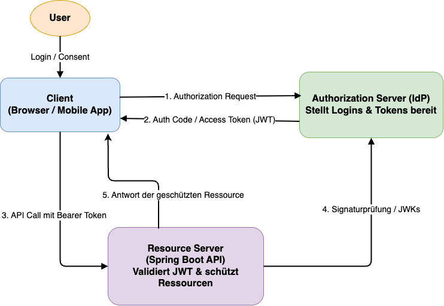

# Architektur von Spring Security

---

## In diesem Modul

* Security-Architektur: Filter Chain, Kernkomponenten
* Web Security DSL: Pfadregeln, CSRF, Form/Login/Bearer Basics
* Method Security: @PreAuthorize & SpEL
* CORS-Konfiguration für APIs
* OAuth2/JWT: Resource Server, Claims → Authorities, Client-Login

---

## Die Security Filter Chain

* Spring Security ist ein **Filter-basierter** Ansatz, der sich in die Servlet Filter Chain einklinkt.
* Jede HTTP-Anfrage durchläuft eine Kette von Security Filtern (z.B. `UsernamePasswordAuthenticationFilter`, `BearerTokenAuthenticationFilter`).
* Die `SecurityFilterChain` ist der zentrale Einstiegspunkt zur Konfiguration.

---
<style scoped>
section {
    font-size: 25px;
}
</style>

## Kernkomponenten

1. **`SecurityContextHolder`**: Hält das `SecurityContext`, welches wiederum das `Authentication`-Objekt enthält.
    * Thread-local, d.h., der Kontext ist für den aktuellen Request-Thread verfügbar.
2. **`Authentication`**: Repräsentiert den aktuell eingeloggten Benutzer.
    * Enthält `principal` (User-Details), `credentials` (Passwort), `authorities` (Rollen/Berechtigungen).
3. **`AuthenticationManager`**: Schnittstelle zur Authentifizierung eines `Authentication`-Objekts.
4. **`AuthenticationProvider`**: Implementierung des `AuthenticationManager`, der die eigentliche Logik zur Überprüfung der Anmeldedaten enthält (z.B. `DaoAuthenticationProvider` für Datenbank-User).
5. **`UserDetailsService`**: Lädt user-spezifische Daten (Username, Passwort, Rollen) zur Authentifizierung.

---

# Web Security Konfiguration

---

## Die SecurityFilterChain-DSL

Die Hauptkonfiguration erfolgt über die `HttpSecurity`-Objekt im `SecurityFilterChain`-Bean.
Auf der folgenden Seite schauen wir uns die Konfiguration im Code an.

---
<style scoped>
section {
    font-size: 20px;
}
</style>

```java
@Configuration
@EnableWebSecurity // Aktiviert Spring Security
@EnableMethodSecurity // Aktiviert Method Security (seit Spring Boot 3)
public class WebSecurityConfig {

    @Bean
    public SecurityFilterChain filterChain(HttpSecurity http) throws Exception {
        http
            .authorizeHttpRequests(auth -> auth
                // Öffentliche Endpoints
                .requestMatchers("/public/**", "/error").permitAll()
                // Admin-Endpoints erfordern spezifische Rolle
                .requestMatchers("/api/admin/**").hasRole("ADMIN")
                // Alle anderen Anfragen erfordern Authentifizierung
                .anyRequest().authenticated()
            )
            .httpBasic(withDefaults()) // HTTP Basic Auth (optional)
            .formLogin(withDefaults()); // Form-basierte Authentifizierung (optional)
            
            // ... weitere Konfigurationen (z.B. OAuth2, Exception Handling)

        return http.build();
    }

    // Für In-Memory User (nur für Entwicklung/Tests)
    @Bean
    public UserDetailsService userDetailsService() {
        UserDetails user = User.withDefaultPasswordEncoder()
            .username("user")
            .password("password")
            .roles("USER")
            .build();
        UserDetails admin = User.withDefaultPasswordEncoder()
            .username("admin")
            .password("admin")
            .roles("ADMIN", "USER")
            .build();
        return new InMemoryUserDetailsManager(user, admin);
    }
}
```

---

# Method Security

---

## Method Security (@EnableMethodSecurity)

Zusätzlich zur URL-basierten Autorisierung kann man Zugriffsregeln direkt an Methoden oder Klassen definieren.

### Aktivierung

Seit Spring Boot 3: `@EnableMethodSecurity` (ersetzt `@EnableGlobalMethodSecurity`).

---

## Annotations (I)

* **`@PreAuthorize("hasRole('ADMIN')")`**: Prüft die Berechtigung *vor* der Ausführung der Methode.
    * Sehr flexibel dank **Spring Expression Language (SpEL)**.
    * `principal`, `authentication`, `hasRole('ROLE_NAME')`, `hasAuthority('SCOPE_NAME')`, `hasPermission(...)`.
    * `#paramName`: Zugriff auf Methodenparameter.

---

## Annotations (II)

* **`@PostAuthorize("returnObject.owner == authentication.name")`**: Prüft die Berechtigung *nach* der Ausführung der Methode (z.B. auf das zurückgegebene Objekt).
    * Vorsicht: Methode wird immer ausgeführt, auch wenn die Autorisierung fehlschlägt.
* **`@PreFilter("filterObject.owner == authentication.name")`**: Filtert Collections *vor* der Methoden-Ausführung.
* **`@PostFilter("filterObject.active == true")`**: Filtert Collections *nach* der Methoden-Ausführung.

---

## Beispiele für `@PreAuthorize`

```java
@Service
@EnableMethodSecurity
public class DocumentService {

    // Nur Admins dürfen Dokumente löschen
    @PreAuthorize("hasRole('ADMIN')")
    public void deleteDocument(Long documentId) {
        // ... Logik
    }

    // Nur der Besitzer oder ein Admin darf das Dokument bearbeiten
    @PreAuthorize("hasRole('ADMIN') or @documentRepository.findById(#documentId).get().owner == authentication.name")
    public Document updateDocument(Long documentId, Document document) {
        // ... Logik
        return document;
    }

    // Nur wenn der Benutzer im Array der erlaubten IDs ist
    @PreAuthorize("#user.id == authentication.principal.id")
    public User saveUser(User user) {
        // ...
        return user;
    }
}
```

---

# CORS (Cross-Origin Resource Sharing)

---

## CORS

Webbrowser verhindern standardmäßig, dass JavaScript-Code, der von `example.com` geladen wird, Anfragen an `api.anothersite.com` sendet (Same-Origin Policy).
CORS ist ein Mechanismus, um diese Regel kontrolliert zu lockern.

---

## Konfiguration in Spring Boot

**1. Globales CORS:**
Für alle Controller (oder bestimmte Pfade).

```java
@Configuration
public class CorsConfig {
    @Bean
    public WebMvcConfigurer corsConfigurer() {
        return new WebMvcConfigurer() {
            @Override
            public void addCorsMappings(CorsRegistry registry) {
                registry.addMapping("/api/**") // Pfade, die CORS erlauben
                        .allowedOrigins("http://localhost:3000", "http://myfrontend.com") // Erlaubte Domains
                        .allowedMethods("GET", "POST", "PUT", "DELETE", "OPTIONS")
                        .allowedHeaders("*") // Erlaubte Header
                        .allowCredentials(true) // Cookies/Auth Header erlauben
                        .maxAge(3600); // Wie lange Preflight-Response cachen
            }
        };
    }
}
```

---
**2. Controller-basierte CORS:**
Mit der `@CrossOrigin`-Annotation direkt am Controller oder an Methoden.

```java
@RestController
@RequestMapping("/products")
@CrossOrigin(origins = "http://localhost:3000", methods = {RequestMethod.GET, RequestMethod.POST})
public class ProductController {
    
    @GetMapping // Erbt @CrossOrigin von der Klasse
    public List<Product> getAllProducts() { /* ... */ }

    @PostMapping("/new")
    @CrossOrigin(origins = "http://anotherexample.com") // Überschreibt für diese Methode
    public Product createProduct(@RequestBody Product product) { /* ... */ }
}
```

`@CrossOrigin` ist gut für feingranulare Kontrolle, die globale Konfiguration für breitere Regeln.

---

# OAuth

---

## OAuth2 & JWT Überblick

Eine OAuth-Architektur besteht stark vereinfacht aus folgenden Komponenten:

* **Authorization Server (IdP):** Verwaltet User & Logins (z.B. Keycloak, Auth0, Google) und stellt Tokens aus.
* **Resource Server (Spring Boot):** Unsere API, die Tokens validiert und Ressourcen schützt.
* **Client:** Frontend oder Mobile App, die das Token beim Resource Server nutzt.

---



---

## JSON Web Tokens

* Ein **JWT** (JSON Web Token) ist ein kompakter, **signierter Token**, der Informationen zwischen zwei Parteien sicher transportiert, typischerweise zwischen Client und Server.
* Er besteht aus **Header**, **Payload** und **Signature** und kann so serverseitig ohne Session-Daten validiert werden.
* JWTs werden häufig für Auth verwendet, weil sie sich leicht übermitteln lassen (z. B. als HTTP-Header) und der Server nur die **Signatur prüfen** muss, um dem Token zu vertrauen.

---

## JWT Struktur

Ein Token besteht aus 3 Base64Url-kodierten Teilen:

1. **Header:** Algorithmus (z.B. HS256, RS256).
2. **Payload (Claims):** Daten (User ID, Expiration, Roles).
3. **Signature:** Überprüfung der Integrität.

<br>


---

## JWT Validierung

Es ist wichtig, die versendeten JWTs auf Gültigkeit zu prüfen, weil sie von Angreifern gefälscht werden könnten.

1. **Signaturprüfung:** Ist das Token unverfälscht? (öffentlicher Schlüssel des Authorization Servers)
2. **Ablaufzeit (`exp`):** Ist das Token noch gültig?
3. **Issuer (`iss`):** Stammt das Token vom erwarteten Authorization Server?
4. **Audience (`aud`):** Ist das Token für diesen Resource Server bestimmt?

---

## Was ist ein Resource Server?

Unsere Spring Boot Anwendung, die geschützte Ressourcen (APIs) anbietet, ist selbst ein Resource Server.

* Akzeptiert JWTs im Header `Authorization: Bearer <token>`.
* Validiert das JWT (Signatur, Ablaufzeit, Issuer).
* Extrahiert Benutzerinformationen und Berechtigungen (Scopes/Rollen).
* Nutzt diese Informationen für die Autorisierung.

---

## Resource Server: Konfiguration

Damit Spring-Anwendungen als Resource Server fungieren, benötigen wir das entsprechende Modul.

**Dependency:** `spring-boot-starter-oauth2-resource-server`

**`application.yml`:**

```yaml
spring:
  security:
    oauth2:
      resourceserver:
        jwt:
          # URI des Authorization Servers, von dem das Token ausgestellt wurde
          issuer-uri: https://your-auth-server.com/realms/your-realm
          # Alternativ: direkter Link zum JWK Set Endpoint
          # jwk-set-uri: https://your-auth-server.com/realms/your-realm/protocol/openid-connect/certs
```

---

## Resource Server: SecurityFilterChain

```java
@Configuration
@EnableWebSecurity
public class SecurityConfig {

    @Bean
    public SecurityFilterChain filterChain(HttpSecurity http) throws Exception {
        http
            .authorizeHttpRequests(auth -> auth
                .requestMatchers("/public/**").permitAll()
                .requestMatchers("/api/admin/**").hasAuthority("SCOPE_admin")
                .anyRequest().authenticated()
            )
            .oauth2ResourceServer(oauth2 -> oauth2.jwt());

        return http.build();
    }
}
```

---

## Zugriff auf JWT-Details

Im Controller kann man das `Jwt`-Objekt oder das `Authentication`-Objekt direkt injizieren.

```java
@RestController
@RequestMapping("/user")
public class UserResource {

    @GetMapping("/me")
    public Map<String, Object> getPrincipalInfo(@AuthenticationPrincipal Jwt jwt) {
        return jwt.getClaims(); // Alle Claims des JWT
    }

    @GetMapping("/roles")
    public Collection<? extends GrantedAuthority> getAuthorities(Authentication authentication) {
        return authentication.getAuthorities(); // Extrahierte Scopes/Rollen
    }
}
```

---

## Custom JWT Converter (Claims zu Authorities)

Standardmäßig mappt Spring die `scope`- oder `scp`-Claims zu Authorities. Wenn Rollen in anderen Claims (`realm_access.roles`) liegen, braucht man einen Custom Converter.

---

```java
@Bean
public JwtAuthenticationConverter jwtAuthenticationConverter() {
    JwtGrantedAuthoritiesConverter grantedAuthoritiesConverter = new JwtGrantedAuthoritiesConverter();
    // Prefix für Scopes entfernen, falls vorhanden (z.B. "SCOPE_" entfernen)
    grantedAuthoritiesConverter.setAuthorityPrefix("");

    JwtAuthenticationConverter jwtConverter = new JwtAuthenticationConverter();
    jwtConverter.setJwtGrantedAuthoritiesConverter(jwt -> {
        Collection<GrantedAuthority> authorities = grantedAuthoritiesConverter.convert(jwt);

        // Extrahiere Rollen aus 'realm_access.roles' (Keycloak-spezifisch)
        if (jwt.hasClaim("realm_access")) {
            Map<String, Object> realmAccess = jwt.getClaimAsMap("realm_access");
            if (realmAccess.containsKey("roles")) {
                List<String> roles = (List<String>) realmAccess.get("roles");
                authorities.addAll(roles.stream()
                    .map(roleName -> new SimpleGrantedAuthority("ROLE_" + roleName.toUpperCase()))
                    .collect(Collectors.toList()));
            }
        }
        return authorities;
    });
    return jwtConverter;
}
```

---

## OAuth2 Client (Optional)

Wenn unsere Spring Boot App selbst ein Client ist, der sich bei einem OAuth2-Provider anmeldet, um auf geschützte Ressourcen *anderer* Services zuzugreifen (z.B. User Login mit Google).

---

**Dependency:** `spring-boot-starter-oauth2-client`

**`application.yml`:**

```yaml
spring:
  security:
    oauth2:
      client:
        registration:
          google: # Registrierung für Google
            client-id: your-google-client-id
            client-secret: your-google-client-secret
            scope: openid,profile,email
        provider:
          google:
            issuer-uri: https://accounts.google.com
```

---

### OAuth2 Client: Nutzung

```java
@RestController
public class OAuth2ClientController {

    @GetMapping("/loginSuccess")
    public String getLoginInfo(@AuthenticationPrincipal OAuth2User oauth2User) {
        return "Logged in as: " + oauth2User.getName();
    }
}
```
