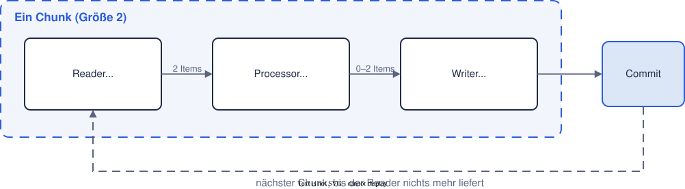
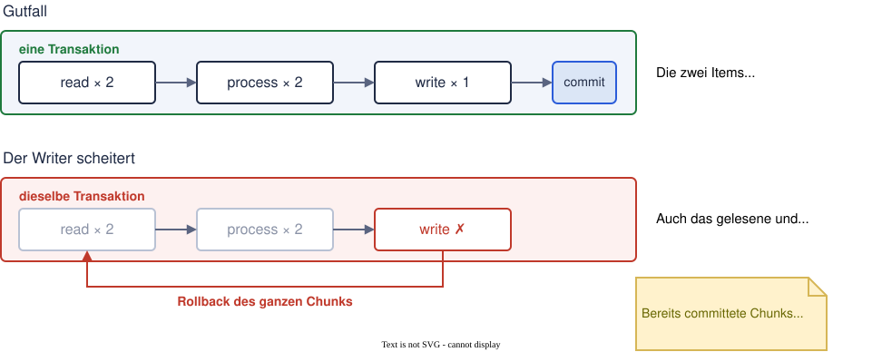
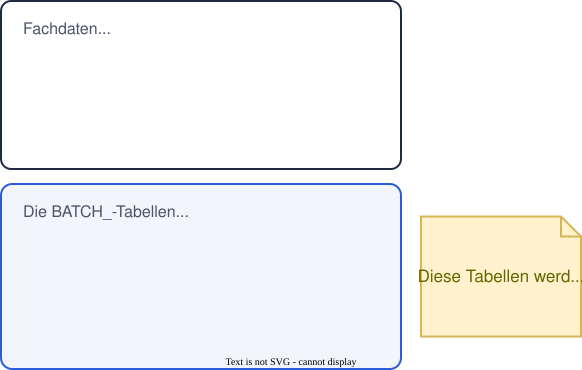
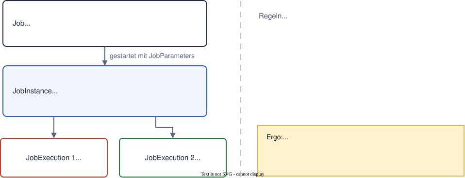

<!-- Dichte-Stufen gegen Folienueberlauf, siehe tools/check-slide-overflow.mjs -->
<style>
section.dense { font-size: 24.5px; }
section.denser { font-size: 21px; }
</style>

# Spring Batch

---

## In diesem Modul

* Wozu Batch und wann es zu viel ist
* Das Chunk-Modell: lesen, verarbeiten, schreiben, committen
* `JobRepository`: warum ein Job Persistenz braucht
* Reader, Processor, Writer und der erste Job
* Skip, Retry und Restart
* Tests für Jobs
* Start einer Batch-Anwendung: Exit-Code und Scheduler

---

# Warum Batch

---

## Wozu Batch?

* Batch für große bis sehr große Datenmengen, zeit- oder ereignisgesteuert
* Genutzt, wenn Durchsatz wichtiger ist als Latenz
* Typisch: Massenimport und -export als Schnittstelle zu Partnersystemen, nächtliche Abrechnungen, Datenmigration, Neuberechnung großer Bestände.

---

## Naive Lösung: ein einfacher For-Loop

Eine Datei einlesen und in einer Schleife wegschreiben könnte man in einem `CommandLineRunner` und ist für einmalige, kleine Fälle die richtige Antwort.

Bei Millionen Zeilen bricht der Ansatz an drei Stellen zusammen:

* **Speicher:** Die Liste aller Zeilen passt nicht in den Heap.
* **Fehler:** Eine kaputte Zeile bei 900.000 Einträgen beendet den ganzen Lauf ohne Fehlerbehandlung
* **Wiederanlauf:** Nach dem Abbruch würde bei Neustart alles noch einmal neu verarbeitet werden

---

## Was Spring Batch dazulegt

Spring Batch ist kein zweites Framework neben Spring.

* Es bleibt eine Spring-Boot-Anwendung. Reader, Processor, Writer und Jobs sind gewöhnliche `@Bean`-Methoden.
* Die `DataSource` ist dieselbe wie im Persistenz-Modul, Transaktionen laufen über denselben `PlatformTransactionManager`.

Neu sind genau zwei Dinge: ein **Ausführungsmodell** für große Datenmengen und eine **Metadaten-Datenbank**, in der jeder Lauf protokolliert wird.

---

# Das Modell

---

## Was ist ein Item?

Ein **Item** ist ein einzelner Datensatz auf dem Weg durch den Job: eine Zeile einer CSV-Datei, eine Zeile eines SQL-Ergebnisses. Im Code ein gewöhnliches Java-Objekt, meistens ein Record:

```java
public record OrderLine(String orderId, String title, int quantity, int unitPriceCents) {

    public int totalCents() {
        return quantity * unitPriceCents;
    }
}
```

---

## Das Chunk-Modell



Chunking ist ein Kompromiss: Chunks sind groß genug, dass Commits selten sind, aber klein genug, dass der Heap-Speicher reicht.

---

## Die vier Phasen

1. **Reader** liest nacheinander Items, bis die Chunk-Größe erreicht oder die Quelle erschöpft ist.
2. **Processor** durchläuft anschließend den ganzen gelesenen Chunk und formt jedes Item um oder verwirft es.
3. **Writer** bekommt den gefilterten Chunk auf einmal und schreibt ihn in einem Durchlauf.
4. **Commit** schließt den Chunk ab.

Reader und Processor arbeiten Item für Item, aber als zwei getrennte Phasen nacheinander. Der Writer sieht immer die vollständige Gruppe.

---

## Wo die Transaktion liegt



---

## Die Chunk-Größe ist das Commit-Intervall

* Eine Transaktion beginnt vor dem ersten `read()` eines Chunks und endet nach dem `write()` des gesamten Chunks.
* Scheitert der Writer, rollt die komplette Transaktion zurück. Auch bereits gelesene und verarbeitete Items desselben Chunks sind dann verworfen.
* **Kleine Chunks** committen häufig. Das bedeutet wenig Verlust im Fehlerfall, aber mehr Aufwand durch Commits.
* Bei **großen Chunks** ist es umgekehrt.
* Einen allgemein richtigen Wert gibt es nicht. Er ergibt sich aus einer Messung gegen die Ziellast.

---

# Jobpersistenz

---

## Warum eine eigene Persistenz für Jobs?



---

## JobInstance und JobExecution



---

<!-- _class: dense -->
## JobParameters und Neustarts

```java
JobParameters parameters = new JobParametersBuilder()
        .addString("input", "orders.csv")
        .toJobParameters();
```

* Die `JobInstance` entsteht aus Jobname und identifizierenden `JobParameters`.
* Zwei Läufe mit gleichem Jobnamen und gleichen identifizierenden Parametern treffen deshalb dieselbe `JobInstance`. Der zweite endet mit `JobInstanceAlreadyCompleteException`.
* Ein erneuter Lauf braucht geänderte identifizierende Parameter, etwa ein neues `runDate`.
* Ein Wiederanlauf dagegen setzt an derselben `JobInstance` an und erzeugt eine neue `JobExecution`. Deshalb kann er dort weitermachen, wo der Abbruch war.

---

# Der erste Job

---

<!-- _class: denser -->
## Setup

```xml
<dependency>
    <groupId>org.springframework.boot</groupId>
    <artifactId>spring-boot-starter-batch-jdbc</artifactId>
</dependency>
```

```yaml
spring:
  datasource:
    url: jdbc:h2:file:./target/orders
  batch:
    jdbc:
      initialize-schema: always
    job:
      name: orderImportJob
```

`spring-boot-starter-batch` bringt den Kern, `-batch-jdbc` zusätzlich das `JobRepository` gegen eine relationale Datenbank. `initialize-schema` legt die `BATCH_*`-Tabellen an; in Produktion steht dort `never` und das Schema wandert ins Migrationswerkzeug wie z.B. Flyway.

---

## Reader, Processor und Writer sind Beans

| Interface             | Aufgabe                                                      |
| --------------------- | ------------------------------------------------------------ |
| `ItemReader<I>`       | liefert das nächste Item, oder `null` wenn nichts mehr kommt |
| `ItemProcessor<I, O>` | formt ein Item um oder verwirft es mit `null`                |
| `ItemWriter<O>`       | bekommt einen ganzen Chunk und schreibt ihn                  |

* Für die gängigen Quellen und Ziele gibt es fertige Implementierungen, jeweils mit Builder. Selbst implementieren müsst ihr in der Regel nur den Processor.
* Die Typparameter verketten sich: Was der Reader liefert, nimmt der Processor entgegen; was der Processor zurückgibt, schreibt der Writer.

---

## Reader: eine CSV-Datei einlesen

```java
@Bean
public FlatFileItemReader<OrderLine> orderReader(@Value("${demo.batch.input}") String input) {
    return new FlatFileItemReaderBuilder<OrderLine>()
            .name("orderReader")
            .resource(new ClassPathResource(input))
            .linesToSkip(1)
            .delimited()
            .names("orderId", "title", "quantity", "unitPriceCents")
            .targetType(OrderLine.class)
            .build();
}
```

* `.name(...)` unter diesem Namen legt der Reader seinen Lesestand ab. Ohne Namen kein Wiederanlauf nach Neustart.
* `.names(...)` benennt die Spalten in ihrer Reihenfolge, `.targetType(...)` bindet sie an die Komponenten des Records.

---

## Processor: umformen und verwerfen

```java
// Zwei Aufgaben in einem Schritt: filtern und anreichern. Rückgabe null
// verwirft das Item, es erreicht den Writer nie und zählt als filtered.
@Bean
public ItemProcessor<OrderLine, OrderLine> pricingProcessor(PricingClient pricingClient) {
    return line -> line.quantity() <= 0 ? null : pricingClient.enrich(line);
}
```

* Ein- und Ausgabetyp dürfen verschieden sein. Hier sind sie gleich, weil nur gefiltert und angereichert wird.
* Verworfene Items zählen als `filterCount`, nicht als `writeCount`. Beide stehen in der `StepExecution`.

---

## Writer: in eine Tabelle schreiben

```java
@Bean
public JdbcBatchItemWriter<OrderLine> orderWriter(DataSource dataSource) {
    return new JdbcBatchItemWriterBuilder<OrderLine>()
            .dataSource(dataSource)
            .sql("insert into book_order (order_id, title, quantity, unit_price_cents) "
                    + "values (:orderId, :title, :quantity, :unitPriceCents)")
            .beanMapped()
            .build();
}
```

Die benannten Parameter verweisen auf Properties des Items. Mit `beanMapped()` wird aktiviert, dass diese Felder in das Java-Objekt gemappt werden. Der Writer schickt den gesamten Chunk als ein einziges JDBC-Batch-Statement. Deshalb bekommt er die Items als Gruppe.

---

## Step und Job

```java
@Bean
public Step importStep(JobRepository jobRepository, PlatformTransactionManager transactionManager,
                       FlatFileItemReader<OrderLine> orderReader,
                       ItemProcessor<OrderLine, OrderLine> pricingProcessor,
                       JdbcBatchItemWriter<OrderLine> orderWriter) {
    return new StepBuilder("importStep", jobRepository)
            .<OrderLine, OrderLine>chunk(2)
            .transactionManager(transactionManager)
            .reader(orderReader).processor(pricingProcessor).writer(orderWriter)
            .build();
}

@Bean
public Job orderImportJob(JobRepository jobRepository, Step importStep, Step reportStep, Step archiveStep) {
    return new JobBuilder("orderImportJob", jobRepository)
            .start(importStep).next(reportStep).next(archiveStep).build();
}
```

`.start(...)` benennt den ersten Step und `.next(...)` hängt weitere sequenziell an. Jeder Step läuft erst, wenn der vorige erfolgreich war.

---

<!-- _class: dense -->
## Tasklet

Einfache Aufgaben lassen sich auch mit Tasklets erledigen. Hier verschiebt ein dritter Step den fertigen Bericht ins Archiv:

```java
public class ArchiveReportTasklet implements Tasklet {
    // Konstruktor setzt report und archiveDir

    @Override
    public RepeatStatus execute(StepContribution contribution, ChunkContext chunkContext) throws Exception {
        if (!Files.exists(report)) {
            contribution.setExitStatus(new ExitStatus("NO_REPORT"));
            return RepeatStatus.FINISHED;
        }
        Files.createDirectories(archiveDir);
        Files.move(report, archiveDir.resolve(report.getFileName()), StandardCopyOption.REPLACE_EXISTING);
        return RepeatStatus.FINISHED;
    }
}
```

Der Exit-Status ist der Rückkanal an den Job. Ein nachgelagerter Flow kann ihn nutzen, ohne die Datei selbst zu kennen.

---

## Tasklet-Step einbinden

```java
@Bean
public Step archiveStep(JobRepository jobRepository,
                        PlatformTransactionManager transactionManager,
                        @Value("${demo.batch.report}") String report,
                        @Value("${demo.batch.archive-dir}") String archiveDir) {
    return new StepBuilder("archiveStep", jobRepository)
            .tasklet(new ArchiveReportTasklet(Path.of(report), Path.of(archiveDir)), transactionManager)
            .build();
}
```

`.tasklet(tasklet, transactionManager)` statt `.chunk(n)`, ansonsten derselbe `StepBuilder`.

---

## Tasklets

* **Tasklets** sind eine einzelne Methode. Jeder Aufruf läuft in einer eigenen Transaktion. `RepeatStatus.CONTINUABLE` wiederholt den Aufruf, `RepeatStatus.FINISHED` beendet den Step.
* Faustregel: Datenmengen mit Struktur gehören in einen Chunk-Step. Ein einmaliger Aufruf ohne Items, z.B. eine Datei verschieben oder ein Flag setzen, gehört in ein Tasklet.

---

# Fehlerbehandlung

---

## Rollbacks

* Eine Transaktion umspannt genau einen Chunk. Eine nicht abgefangene Exception in einer der drei Phasen rollt den ganzen Chunk zurück, auch die Items, die bereits fehlerfrei durchgelaufen sind.
* Ohne Fehlertoleranz endet der Step damit `FAILED`.
* Der Lesefortschritt wird erst mit dem Commit persistiert. Der Reader hat die Zeilen des zurückgerollten Chunks intern zwar gelesen, dieser Fortschritt geht mit der abgebrochenen Ausführung verloren.
* Skip und Retry helfen bei der Fehlerbehandlung

---

## faultTolerant(): skip und retry

```java
@Bean
public Step faultTolerantStep() {
    return new StepBuilder("importStep", jobRepository)
            // ...
            .faultTolerant()
            // Datenfehler: eine kaputte Zeile bleibt kaputt, überspringen.
            .skip(FlatFileParseException.class)
            .skipLimit(3)
            .skipListener(new RejectFileSkipListener(Path.of("target/rejected.csv")))
            // Technischer Fehler: derselbe Aufruf kann später gelingen.
            .retry(PricingUnavailableException.class)
            .retryLimit(3)
            .build();
}
```

---

## Skip oder Retry?

* **Skip** passt zu Fehlern, die am Datensatz selbst liegen und durch Wiederholung nicht verschwinden
* **Retry** passt zu technischen, vorübergehenden Fehlern, bei denen derselbe Aufruf mit denselben Daten später erfolgreich sein kann, z.B. eine API, die kurz nicht antwortet.
* Beide greifen nacheinander, nicht parallel: zuerst der Retry bis zu seiner Grenze, erst ein danach weiter fehlschlagendes Item wird auf Skip geprüft.

---

## Abspeichern von Fehlern in eine Datei

```java
public class RejectFileSkipListener implements SkipListener<OrderLine, OrderLine> {
    // ...

    @Override
    public void onSkipInRead(Throwable cause) {
        append(cause.getMessage());
    }

    @Override
    public void onSkipInProcess(OrderLine item, Throwable cause) {
        append(item.orderId() + ";" + cause.getMessage());
    }
}
```

`SkipListener<T, S>` bietet zusätzlich `onSkipInWrite(S, Throwable)`; alle drei sind Default-Methoden.

---

## Restarts

* `JobOperator.restart(JobExecution)` startet eine fehlgeschlagene Ausführung erneut, als neue `JobExecution` derselben `JobInstance`.
* Ein Step, der bereits `COMPLETED` ist, läuft dabei nicht erneut.
* Innerhalb eines wiederholten Steps setzt die Verarbeitung beim letzten erfolgreich committeten Chunk auf

---

## Tests: @SpringBatchTest

```java
@SpringBatchTest
@SpringBootTest(properties = {
        "spring.batch.job.enabled=false",
        "spring.datasource.url=jdbc:h2:mem:import-test;DB_CLOSE_DELAY=-1",
        "demo.batch.input=orders-defekt.csv"
})
class OrderImportJobTest {

    @Autowired
    private JobOperatorTestUtils jobOperatorTestUtils;
```

`@SpringBatchTest` registriert einen `JobOperatorTestUtils`-Bean mit `startJob()`, `startStep(...)` und `getUniqueJobParameters()`. `JobLauncherTestUtils` ist seit 6.0 `@Deprecated(forRemoval = true)`.

---

## Assertions auf der StepExecution

```java
@Test
public void jobTest() {
    JobExecution execution = jobOperatorTestUtils.startJob();
    
    assertThat(execution.getStatus()).isEqualTo(BatchStatus.COMPLETED);
    
    StepExecution step = execution.getStepExecutions().stream()
            .filter(each -> each.getStepName().equals("importStep"))
            .findFirst()
            .orElseThrow();
    assertThat(step.getSkipCount()).isEqualTo(2);
    assertThat(step.getFilterCount()).isEqualTo(1);
    assertThat(step.getWriteCount()).isEqualTo(3);
}
```

---

# Von außen starten

---

## Ein Batch-Artefakt hat einen Anfang und ein Ende

Eine normale Webanwendung läuft permanent und wartet auf Requests. Ein Batch-Job hingegen startet, arbeitet Daten ab und ist danach fertig. Das sind zwei verschiedene Sorten von Anwendungen.

Für das Artefakt heißt das:

* Kein Server und kein Port
* `spring.batch.job.enabled` steht per Default auf `true`. Liegt eine `Job`-Bean im Kontext, startet Boot sie beim Hochfahren.
* `spring.batch.job.name` wählt aus, welcher Job läuft, wenn das Artefakt mehrere mitbringt.

---

## Der Start

```bash
java -jar target/sb-advanced-batch-demo-finished-1.0.0-SNAPSHOT.jar
```

Wenn man andere Dateien verarbeiten will, überschreibt man Properties auf der Kommandozeile:

```bash
java -jar target/sb-advanced-batch-demo-finished-1.0.0-SNAPSHOT.jar \
    --demo.batch.input=orders-defekt.csv --demo.batch.skip-limit=1
```

---

## Ein gescheiterter Job meldet Erfolg

Nach dem Lauf steht das Ergebnis im `JobRepository`. Wichtig: Spring Batch wirft keine Exception, wenn der Job scheitert.
Wollen wir den Exit-Code von Batch weiterreichen, geht das so:

```java
public static void main(String[] args) {
    ConfigurableApplicationContext context = SpringApplication.run(BatchDemoApplication.class, args);
    System.exit(SpringApplication.exit(context));
}
```

---

## Wer den Prozess startet

* **Ein externer Scheduler**: z.B. Control-M, ein Kubernetes-Job oder ein CI-Schritt.
* **Ein Scheduler in der Anwendung**, über `@Scheduled` in Spring selbst

---

## Und im Test?

```java
@SpringBootTest(properties = "spring.batch.job.enabled=false")
```

Der Test ist die eine Stelle, an der der automatische Start stört: Sonst läuft der Job zweimal: einmal beim Hochfahren des Kontexts, einmal in der Testmethode. Beim zweiten Mal stehen die Zeilen schon in der Tabelle, und der Writer scheitert am Primärschlüssel.

Deshalb schaltet ihn jeder Job-Test ab und startet ihn selbst.

---

## Code und Übung

* `demos/sb-advanced-batch-demo`: `-start` mit fünf TODO-markierten Schritten für das Live-Coding, `-finished` als vollständige Referenz mit zwei Integrationstests.
* `assignments/sb-advanced-batch-assignment`: Teilnehmer-Import mit Fehlertoleranz, sieben Aufgaben. Lösung unter `solutions/sb-advanced-batch-solution`.

---

# Anhang: Zum Nachschlagen

Die folgenden Folien sind eine Übersicht über die Kernklassen von Spring Batch.

---

<!-- _class: dense -->
## Zum Nachschlagen: Job-Ebene

| Typ            | Paket                                | Bedeutung                                                                  |
| -------------- | ------------------------------------ |----------------------------------------------------------------------------|
| `Job`          | `org.springframework.batch.core.job` | Ablauf als Folge von Steps, als Bean konfiguriert                          |
| `JobInstance`  | `org.springframework.batch.core.job` | Eine logische Ausführung aus Jobname und identifizierenden `JobParameters` |
| `JobExecution` | `org.springframework.batch.core.job` | Ein konkreter Ausführungsversuch, mit Status und Zeitstempeln              |

---

<!-- _class: denser -->
## Zum Nachschlagen: Step-Ebene und Infrastruktur

| Typ             | Paket                                       | Bedeutung                                                            |
| --------------- | ------------------------------------------- |----------------------------------------------------------------------|
| `Step`          | `org.springframework.batch.core.step`       | Eine Phase innerhalb eines Jobs                                      |
| `StepExecution` | `org.springframework.batch.core.step`       | Ein Ausführungsversuch eines Steps, mit Read-, Write- und Skip-Count |
| `JobRepository` | `org.springframework.batch.core.repository` | Persistiert Job-Informationen in `BATCH_*`-Tabellen                  |
| `JobOperator`   | `org.springframework.batch.core.launch`     | Starten, Neustarten, Stoppen, Abfragen                               |

Beide Beans konfiguriert Boot automatisch, sobald der Starter auf dem Klassenpfad liegt.

---

<!-- _class: dense -->
## Zum Nachschlagen: Reader und Writer

Alle Pakete unterhalb von `org.springframework.batch.infrastructure.item`:

| Quelle           | Reader                                         | Writer                                  | Unterpaket                                 |
| ---------------- | ---------------------------------------------- | --------------------------------------- | ------------------------------------------ |
| Datei            | `FlatFileItemReader`                           | `FlatFileItemWriter`                    | `.file` (Builder: `.file.builder`)         |
| JDBC             | `JdbcCursorItemReader`, `JdbcPagingItemReader` | `JdbcBatchItemWriter`                   | `.database` (Builder: `.database.builder`) |
| JPA / Repository | `JpaPagingItemReader`, `RepositoryItemReader`  | `JpaItemWriter`, `RepositoryItemWriter` | `.database` bzw. `.data`                   |
| JSON             | `JsonItemReader`                               | `JsonFileItemWriter`                    | `.json` (Builder: `.json.builder`)         |
